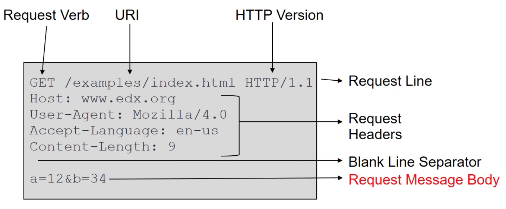
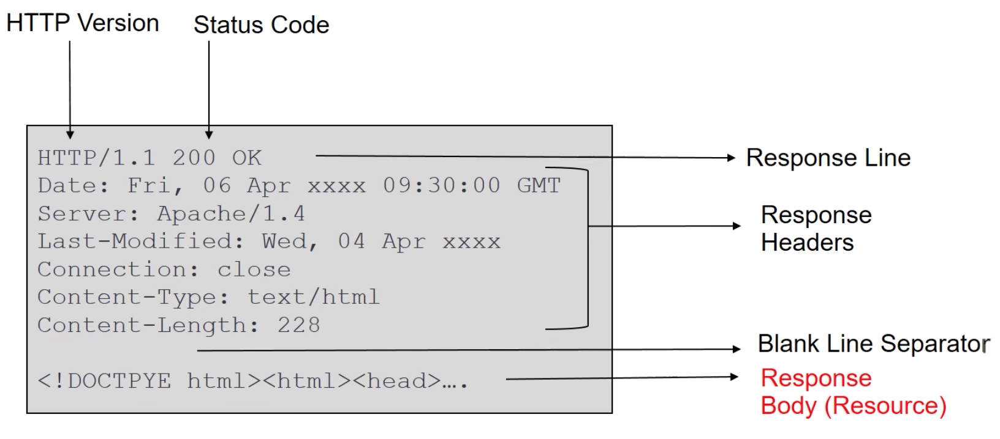

# Internet Primer

These are the basics of how the internet works.

## IP Address

__Uniform Resource Identifier (URI)__ - alphanumeric string of characters used to uniquely identify a web page or resource.

__Uniform Resource Locator (URL)__ - Type of URI that specifies the location on the WWW and the mechanism (protocol) for retrieving it.

__IP addresses__ identify your computer with a unique address. This ensures information is sent and received at the correct location.

* Originally, they were 32-bit addresses (IPv4) broken into four clusters of 8-bytes or four integers from 0 to 255 - w.x.y.z
    * This only allowed for about 4 billion addresses.
* To allow for more addresses, a system of 128-bit addresses (IPv6) has been introduced.
    * This is eight clusters of 16 bytes represented by hexidecimal (0, ffff).
    
__DHCP Server (Dynamic Host Configuration Protocol)__

Role is to assign IP addresses to your devices.

* Exists between your computer and the Internet at large.
* Previously, system adminstrators would need to manually assign IP addresses.

__DNS (Domain Name System)__

Translates IP addresses to more memorable, human-comprehensible names.

* The "yellow pages" of the internet.
* Large DNS server systems aggregate smaller sets of DNS information and update frequently.
* DNS record sets are fairly decentralised.

## Access points

Modern home networks consist of access points that combine a router, a modem, a switch, and other technologies together into a single device.

Modern business networks or large-scane wide-area networks (WANs) still have these as separate devices to allow the size of their network to scale more easily.

__Routers__ 

Allow data requests from all the devices on your local network to be processed through a single IP address.

Every network is connected to a limited number of routers (they are not connected to other networks).
* More efficient for larger networks.
Some networks are physically connected to other networks.
* More efficient for smaller networks.

* Each IP address is assigned to a router.
* A router acts as a traffic cop. The router connects to the internet at large.
    * Routers direct information towards their destination based on the IP address.
        * This information might be contained in a routing table within the router.
            * The routing table probably contains information on the cost of taking particular routes.
* Each local device is connected to the router, not the IP address.

## The Internet

A large, interconnected network created by weaving together local, small networks.
* More specifically, a network of machines (servers, clients, routers, switches, etc) connected by media (fiber, wifi, etc) that allows communication among devices.
    * The __World Wide Web__ is an __application__ - a network of documents that sits on top of the internet.
        * This is what allows for the transfer of data and communication across devices.

* Think of these small networks as isolated communities with a single road leading in or out.

__IP (Internet Protocol)__

A set of rules that defines how local, small networks communicate.

* Information is directed to different routers according to the IP address.
* IP splits data into _packets_ to prevent large amounts of data from throttling the network for other users.
* A connectionless protocol with no necessarily defined path from sender to receiver and vice versa.
    * Allows for flexibility in the network. Traffic jams can be avoided by re-routing.
    
__TCP (Transmission Control Protocol)__

Complements IP (think: TCP/IP).
Deals with any lost packets.

## HTTP (Hypertext Transfer Protocol)

_The browser and WWW utilise HTTP to transfer documents._

An example of an application layer protocol that specifically dictates the format by which clients __request__ web pages from a server (possibly including client information), and the format via which servers __return__ information (including header / status information) to clients.
* Based on client-server model 

Contrasts with device-to-device protocol.

HTTP: The system of rules for engagement when working with a web page.

Other application layer protocols include: FTP (File Transfer Protocol), SMTP (Simple Mail Transfer Protocol), XMPP (Extensible Message and Presence Protocol).

_HTTP request line_: The first line of a HTTP request.
Takes the form: method (GET or POST) request-target http-version (http/1.1)

First line of a server's response to a HTTP request looks like: http-version (http/1.1) status (200 = success)
* Visible in Network tab of Developer Tools.

### HTTP Request

### HTTP Response

# How a browser works

__Browser__ - a software that is used to access and display Web content, and to navigate across the Web.

## Main components

__Rendering Engine (HTML/CSS)__ - responsible for static content presentation, formatting, and layout

__JavaScript Engine (JavaScript)__ - responsible for creating and modifying dynamic content and appearance